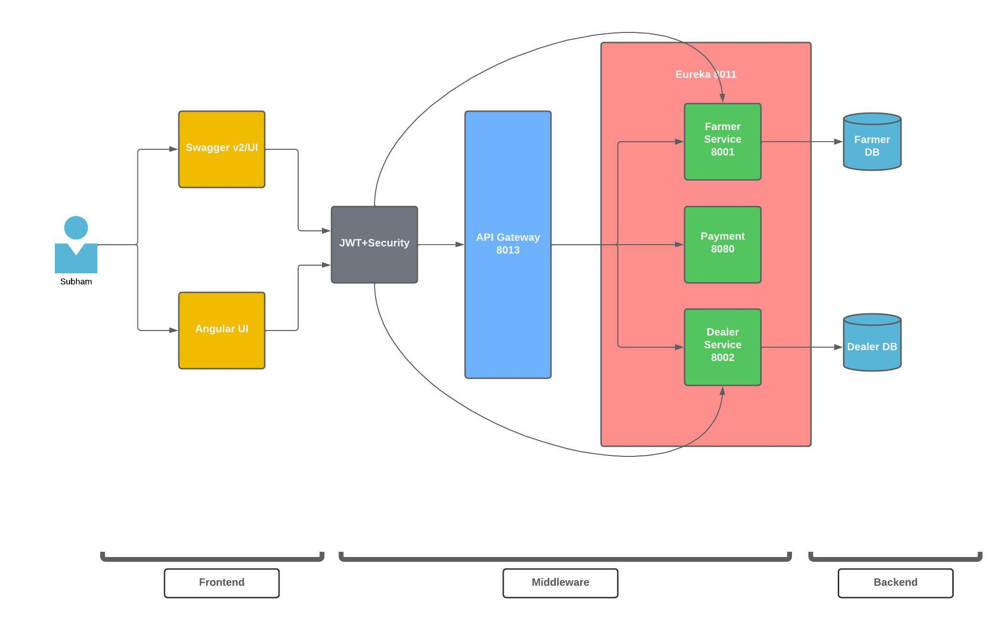

# Agriculture Crop Management System (AGRIKON)

Agrikon is an Agro based website, enabling and creating concrete paths for the Farmers and the Dealers to sell and buy quality crops through technology and ideas. This Web Application has two service for the Farmers and the Dealers respectively. While, the Farmers can add their crops on the site, having access to modify, update and remove their added crops keeping in mind that they maintain the transperacy of their added details throughout. On the other hand, Dealers can buy crops that were added by the payment after thoroughly checking the quality, quantity and amount as per their needs and requirements. Quality, transparent and pocket friendly datas are our main priority.

## Architecture Diagram

Architecture Diagram is shown below,

## Case Study Video Link

Video here : https://drive.google.com/file/d/1kBfJ5oW6IoA_nrCEpepShkJPVy56vLNP/view
